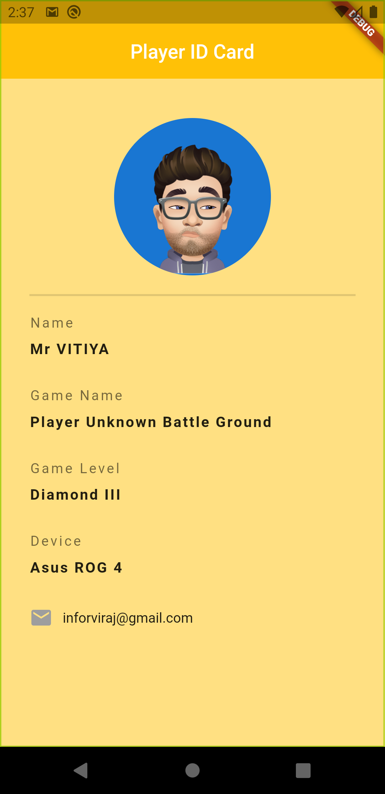
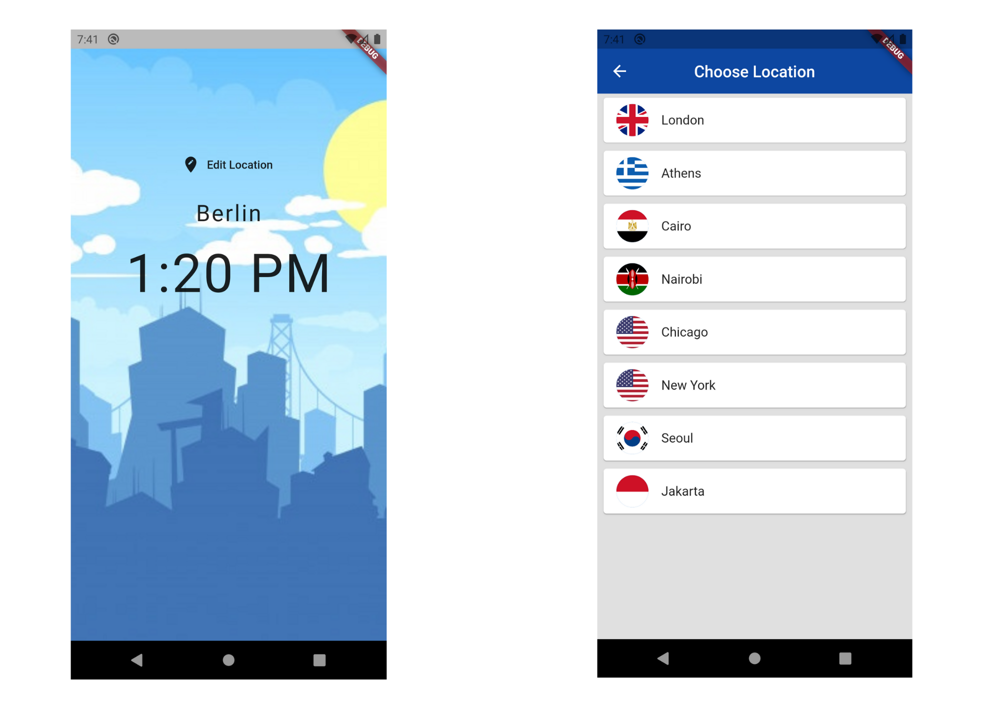

## Flutter Mobile Application Devalopment
[Documentation](https://www.flutter.dev/)
----
#### What is Flutter ?
Flutter is an open-source UI software development kit created by Google. It is used to develop cross platform applications for Android, iOS, Linux, Mac, Windows, Google Fuchsia, and the web from a single codebase. The first version of Flutter was known as codename "Sky" and ran on the Android operating system.

#### Install Flutter
* Create Directory called `src` in C drive
* Open Command Prompt and Run `git clone https://github.com/flutter/flutter.git -b stable`

----
#### POC Project Preview
1. vitiya_id - Simple Application

2. world_time - Current Time Mobile Application

Some erorrs may occured due to high usage of World Time Public API